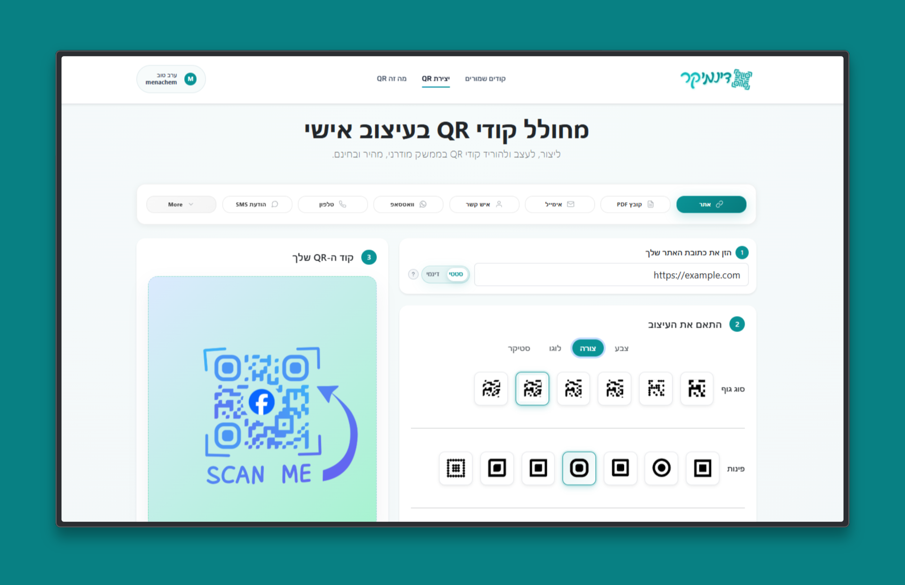

# דינמיקר (DynamiQR)

פלטפורמת דינמיקר ליצירה וניהול של קודי QR בעברית (RTL), עם התאמה אישית מתקדמת, חשבון משתמש ושמירת קודים שמורים.

הפרויקט כולל **אתר (Web)**, **שרת (Backend)** ו**אפליקציית מובייל (Expo / React Native)** — כולם בעברית ומיועדים לעבודה מול אותו API.

---

## תצוגת המערכת — אתר

<p align="center">
  
</p>

---

## אפליקציית מובייל

אפליקציית **דינמיקר** ל-Android (Expo) — ממשק מלא בעברית, RTL, עם אותן יכולות ליבה כמו באתר.

### צילומי מסך

<p align="center">
  
  &nbsp;&nbsp;&nbsp;
  
</p>

### יכולות באפליקציה

| מסך | תיאור |
|-----|--------|
| **קודים שמורים** | רשימת QR שמורים, תיקיות, חיפוש, סטטיסטיקות ועריכת QR דינמי |
| **יצירת QR** | זרימת 3 שלבים: תוכן → עיצוב (צבעים, גרדיאנטים, צורות, לוגו, סטיקר) → שיתוף/שמירה |
| **סריקת QR** | מצלמה עם מסגרת סריקה, פלאש, ופתיחת קישורים אוטומטית |
| **מדריך** | מדריך קצר לעסקים — שימושים, שלבים, סטטי מול דינמי |
| **חשבון** | התחברות, הרשמה, פרופיל, מצב כהה ונגישות |

### טכנולוגיות (מובייל)

- Expo 54 · React Native 0.81 · React Navigation 7
- `expo-camera` (סריקה) · `react-native-view-shot` (ייצוא עם רקע)
- `expo-sharing` / `expo-media-library` (שיתוף ושמירה לגלריה)
- `@tabler/icons-react-native` · תמיכה מלאה ב-RTL

### התקנה והרצה (מובייל)

```bash
cd mobile
npm install
```

צרו קובץ `mobile/.env` לפי `mobile/.env.example`:

```env
EXPO_PUBLIC_API_URL=http://192.168.1.0:5000
```

- **אמולטור / מכשיר באותה רשת:** החליפו ב-IP המקומי של המחשב (`ipconfig` ב-Windows).
- **מכשיר פיזי מרחוק:** השתמשו ב-`npm run phone` (tunnel) או בכתובת ה-Backend הציבורית (Render).

הרצה:

```bash
cd mobile
npm start
# או
npm run android
```

> **חשוב:** ה-Backend חייב לרוץ ולהיות נגיש מהמכשיר. ל-QR דינמי בפרודקשן — השתמשו בכתובת ציבורית (ראו [פריסה ל-Render](#פריסה-חינמית-render-כדי-ש-qr-דינמי-יעבוד-גם-בטלפון)).

### מבנה תיקיות (מובייל)

```
mobile/
├── App.js                 # נקודת כניסה + ניווט
├── app.json               # הגדרות Expo (הרשאות מצלמה, גלריה, RTL)
├── src/
│   ├── screens/           # מסכים ראשיים
│   ├── components/        # רכיבי UI
│   ├── navigation/        # Tab + Stack
│   ├── hooks/             # לוגיקת יצירת QR
│   ├── context/           # Auth, נגישות, ערכת נושא
│   └── utils/             # API, ייצוא, עזרי RTL
└── assets/                # סטיקרים, לוגואים, צילומי מסך
```

---

## למי המערכת מיועדת

המערכת מתאימה לעסקים, בעלי אתרים ויוצרים שרוצים ליצור קודי QR מעוצבים לשיתוף מהיר של קישורים, קבצים, פרטי קשר ותוכן שיווקי — מהדפדפן או מהטלפון.

## יכולות מרכזיות

- יצירת QR למגוון שימושים: אתר, PDF, אימייל, טלפון, SMS, WhatsApp, Wi‑Fi, vCard ורשתות חברתיות.
- התאמה אישית מלאה: צבעים, גרדיאנטים, סגנון נקודות ופינות, לוגו וסטיקרים.
- הורדה / שיתוף באיכות גבוהה (`PNG` באתר; שיתוף ושמירה באפליקציה).
- מערכת משתמשים: הרשמה, התחברות, עדכון פרופיל והתנתקות.
- שמירת QR באזור האישי, תיקיות, וסטטיסטיקות ל-QR דינמי.
- ממשק מלא בעברית עם תמיכה ב-RTL (אתר + מובייל).
- מצב כהה ותפריט נגישות באפליקציה.

---

## התחלה מהירה

### דרישות

- Node.js 18 ומעלה
- npm
- MongoDB (מקומי או בענן)
- **למובייל:** Expo Go או Android Emulator / מכשיר פיזי

### התקנה

```bash
# Frontend (אתר)
cd frontend
npm install

# Backend (שרת)
cd ../backend
npm install

# Mobile (אופציונלי)
cd ../mobile
npm install
```

### הגדרת משתני סביבה (Backend)

צרו קובץ `backend/.env`:

```env
MONGO_URI=your_mongodb_connection_string
SESSION_SECRET=replace_with_strong_secret
JWT_SECRET=replace_with_jwt_secret
FRONTEND_URL=http://localhost:5173
BACKEND_URL=http://localhost:5000
```

### הרצה מקומית

טרמינל 1 — Backend:

```bash
cd backend
npm run dev
```

טרמינל 2 — Frontend:

```bash
cd frontend
npm run dev
```

טרמינל 3 — Mobile (אופציונלי):

```bash
cd mobile
npm start
```

כתובות ברירת מחדל:

| שירות | כתובת |
|--------|--------|
| Frontend | `http://localhost:5173` |
| Backend | `http://localhost:5000` |
| Mobile (Expo) | QR בטרמינל / `exp://...` |

---

## פריסה חינמית (Render) כדי ש-QR דינמי יעבוד גם בטלפון

כדי שסריקה מהטלפון תעבוד, ה-QR הדינמי חייב להפנות לכתובת ציבורית (לא `localhost`).

### 1) פריסת Backend ל-Render

הפרויקט כולל `render.yaml` בשורש — ניתן לפרוס ישירות מ-GitHub.

ב-Render:

1. `New +` → `Blueprint`
2. בחרו את הריפו
3. אשרו יצירת `qr-code-creator-backend`
4. הגדירו Environment Variables (לפחות):
   - `MONGO_URI` (Mongo Atlas)
   - `SESSION_SECRET`
   - `JWT_SECRET`
   - `FRONTEND_URL` (דומיין הפרונט)
   - `BACKEND_URL` (דומיין ה-Render)

### 2) הגדרת Frontend לדומיין הציבורי

צרו `frontend/.env` לפי `frontend/.env.example`:

```env
VITE_API_URL=https://your-backend-domain.onrender.com
VITE_PUBLIC_QR_BASE=https://your-backend-domain.onrender.com
```

בנו והעלו את ה-frontend מחדש.

### 3) הגדרת אפליקציית המובייל לפרודקשן

ב-`mobile/.env`:

```env
EXPO_PUBLIC_API_URL=https://your-backend-domain.onrender.com
```

### 4) בדיקה מהירה מהטלפון

1. מייצרים QR דינמי חדש (אתר או אפליקציה).
2. מוודאים שהקישור נראה כמו:  
   `https://your-backend-domain.onrender.com/api/r/<slug>`
3. סורקים מהטלפון — הפניה ליעד ועדכון סטטיסטיקה.
4. משנים יעד ל-QR קיים ובודקים שהסריקה הבאה מפנה ליעד החדש.

---

## איך משתמשים

### באתר

1. בוחרים סוג QR.
2. מזינים תוכן (קישור, מספר, טקסט וכו').
3. מבצעים התאמה עיצובית.
4. מייצרים ומורידים ב-`PNG` או `SVG`.
5. משתמש מחובר — גישה לקודים שמורים.

### באפליקציה

1. **יצירת QR** — בוחרים סוג, מזינים תוכן, מעצבים, ואז **שתף / שמור**.
2. **קודים שמורים** — ניהול, תיקיות, הורדה וסטטיסטיקות.
3. **סריקה** — מצלמה עם פלאש; קישורים נפתחים אוטומטית.

---

## אבטחה ופרטיות

- קובץ `.env` אינו אמור להיכנס ל-Git.
- סשנים מנוהלים בצד השרת עם `httpOnly` cookies.
- סיסמאות נשמרות מוצפנות (`bcrypt`).
- Rate limiting על נקודות API רגישות.

---

## API עיקרי

- `POST /api/generate-qr`
- `POST /api/auth/register`
- `POST /api/auth/login`
- `POST /api/auth/logout`
- `GET /api/auth/me`
- `PUT /api/auth/profile`
- `GET /api/r/:slug` — הפניה ל-QR דינמי + ספירת סריקות

---

## מבנה הפרויקט

```
QR-code-creator/
├── frontend/          # React + Vite — אתר
├── backend/           # Express + MongoDB — API
├── mobile/            # Expo — אפליקציית Android
├── render.yaml        # תצורת פריסה ל-Render
└── README.md
```

---

## פתרון תקלות נפוצות

| בעיה | פתרון |
|------|--------|
| התחברות נכשלת | וודאו ש-MongoDB זמין ו-`MONGO_URI` תקין |
| לא נוצר QR | וודאו שה-Backend פעיל על פורט `5000` |
| אין סשן בדפדפן | עבודה מול `localhost`, cookies מאופשרים |
| האפליקציה לא מתחברת לשרת | בדקו `EXPO_PUBLIC_API_URL` — IP נכון או כתובת Render |
| QR דינמי לא עובד בטלפון | השתמשו ב-`BACKEND_URL` ציבורי, לא `localhost` |
| פלאש נשאר דלוק אחרי סריקה | עדכנו לגרסה האחרונה — המצלמה מתנתקת ביציאה מהמסך |

---

## רישיון

Private project © menmen770
